## General Graph Legend
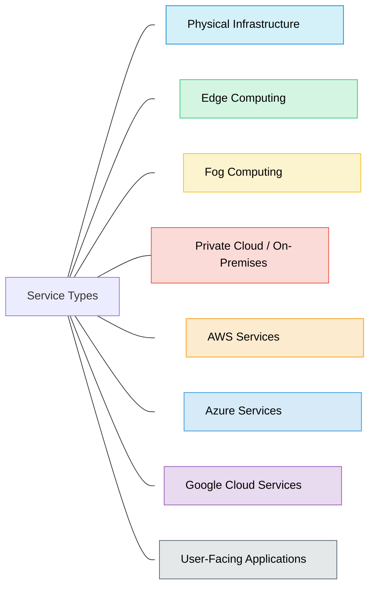

## Emergency Services:
```mermaid

flowchart TD


    %% Class definitions for cloud services
    classDef physical fill:#D4F1F9,stroke:#0E86D4,color:black
    classDef edge fill:#D5F5E3,stroke:#2ECC71,color:black
    classDef fog fill:#FCF3CF,stroke:#F1C40F,color:black
    classDef private fill:#FADBD8,stroke:#E74C3C,color:black
    classDef awsServices fill:#FDEBD0,stroke:#F39C12,color:black
    classDef azureServices fill:#D6EAF8,stroke:#3498DB,color:black
    classDef gcpServices fill:#E8DAEF,stroke:#9B59B6,color:black
    classDef userFacing fill:#E5E8E8,stroke:#566573,color:black
    
    %% Apply classes to nodes
    class A,C,H,I physical
    class B edge
    class F fog
    class E private
    class G,K awsServices
    class J azureServices
    class L userFacing
    class D physical

    %% Annotations
    subgraph Deployment
        direction TB
        M[AWS Lambda: Real-time route optimization]:::awsServices
        N[Azure Cosmos DB: Emergency data storage]:::azureServices
        O[AWS SageMaker: Response analytics]:::awsServices
        P[Edge Devices: NVIDIA Jetson]:::edge
        Q[Fog Nodes: Containerized services on local hardware]:::fog
    end
```

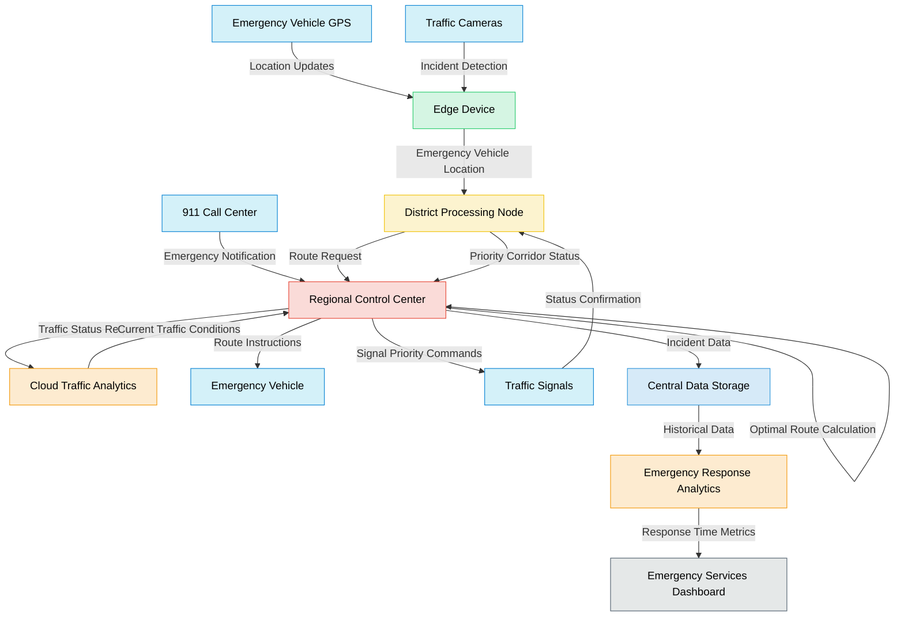

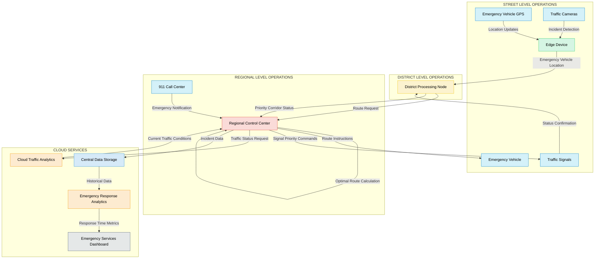

## Adaptive Traffic Signaling
```mermaid
flowchart TD


    %% Class definitions for cloud services
    classDef physical fill:#D4F1F9,stroke:#0E86D4,color:black
    classDef edge fill:#D5F5E3,stroke:#2ECC71,color:black
    classDef fog fill:#FCF3CF,stroke:#F1C40F,color:black
    classDef private fill:#FADBD8,stroke:#E74C3C,color:black
    classDef awsServices fill:#FDEBD0,stroke:#F39C12,color:black
    classDef azureServices fill:#D6EAF8,stroke:#3498DB,color:black
    classDef gcpServices fill:#E8DAEF,stroke:#9B59B6,color:black
    classDef userFacing fill:#E5E8E8,stroke:#566573,color:black
    
    %% Apply classes to nodes
    class A,C,D,F,J physical
    class B edge
    class E,I fog
    class G private
    class H,L gcpServices
    class K azureServices
    class M,N userFacing


    %% Annotations
    subgraph Deployment
        direction TB
        O[GCP AI Platform: Traffic prediction models]:::gcpServices
        P[Azure Time Series Insights: Performance data]:::azureServices
        Q[Intel NUCs: Edge processing units]:::edge
        R[Kubernetes clusters: District nodes]:::fog
        S[Web/Mobile: Public interfaces]:::userFacing
    end
```

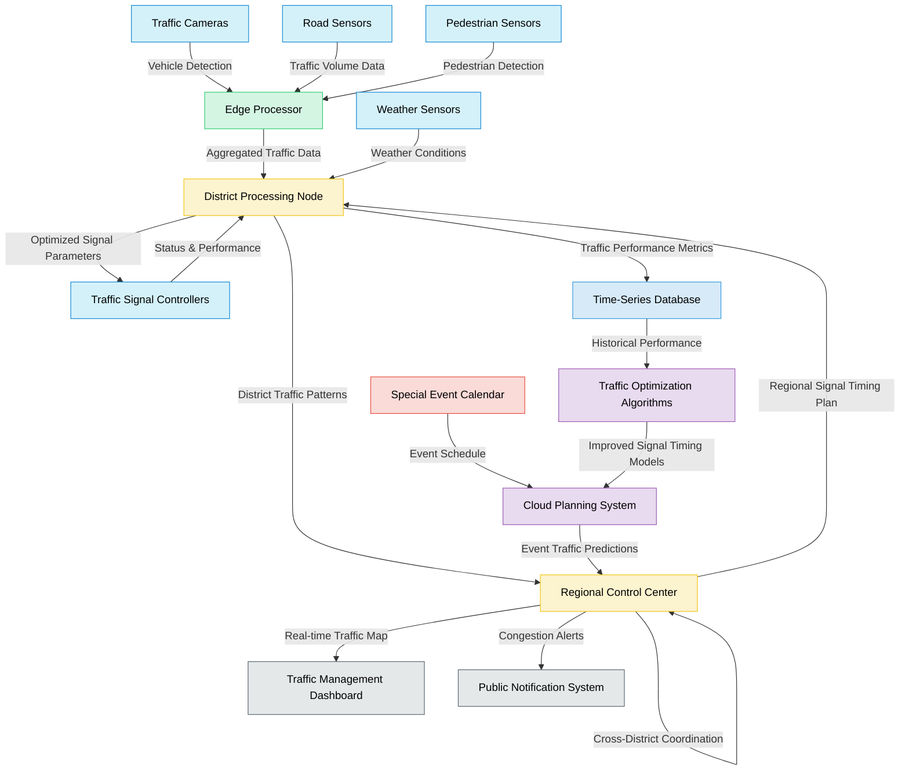

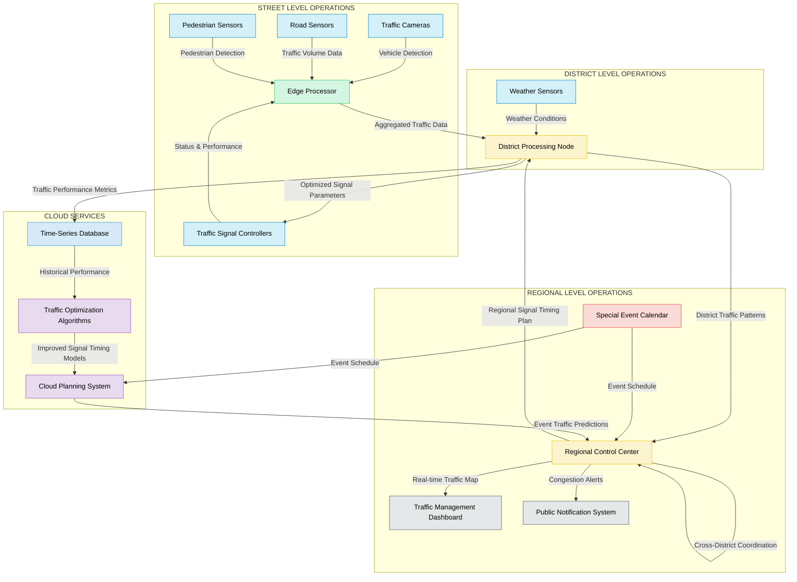

## Enviromental Impact Monitoring

```mermaid
flowchart TD
    %% Class definitions for cloud services
    classDef physical fill:#D4F1F9,stroke:#0E86D4,color:black
    classDef edge fill:#D5F5E3,stroke:#2ECC71,color:black
    classDef fog fill:#FCF3CF,stroke:#F1C40F,color:black
    classDef private fill:#FADBD8,stroke:#E74C3C,color:black
    classDef awsServices fill:#FDEBD0,stroke:#F39C12,color:black
    classDef azureServices fill:#D6EAF8,stroke:#3498DB,color:black
    classDef gcpServices fill:#E8DAEF,stroke:#9B59B6,color:black
    classDef userFacing fill:#E5E8E8,stroke:#566573,color:black
    
    %% Apply classes to nodes
    class A,C,D,G,I physical
    class B,H edge
    class E fog
    class F,R private
    class J,L gcpServices
    class N,S awsServices
    class K azureServices
    class M,O,P,Q userFacing
    %% Annotations
    subgraph Deployment
        direction TB
        T[GCP BigQuery: Environmental data lake]:::gcpServices
        U[AWS SageMaker: Predictive models]:::awsServices
        V[Azure Data Explorer: Historical traffic data]:::azureServices
        W[Docker containers on IoT gateways: Edge nodes]:::edge
        X[React dashboards: Environmental monitoring]:::userFacing
    end
```

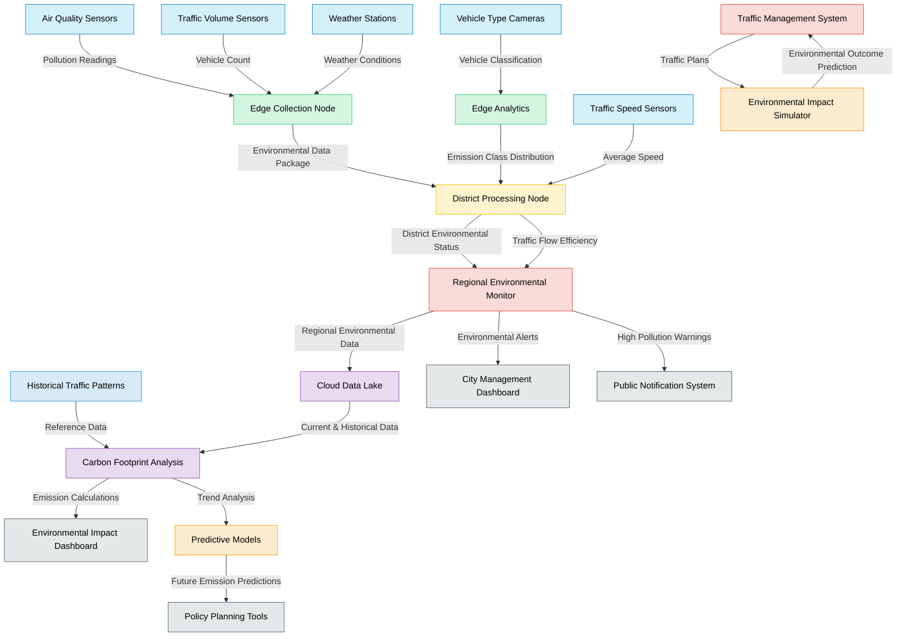
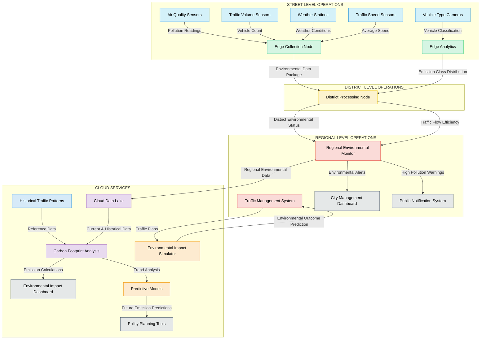

## Public Information Services

```mermaid
flowchart TD
    %% Class definitions for cloud services
    classDef physical fill:#D4F1F9,stroke:#0E86D4,color:black
    classDef edge fill:#D5F5E3,stroke:#2ECC71,color:black
    classDef fog fill:#FCF3CF,stroke:#F1C40F,color:black
    classDef private fill:#FADBD8,stroke:#E74C3C,color:black
    classDef awsServices fill:#FDEBD0,stroke:#F39C12,color:black
    classDef azureServices fill:#D6EAF8,stroke:#3498DB,color:black
    classDef gcpServices fill:#E8DAEF,stroke:#9B59B6,color:black
    classDef userFacing fill:#E5E8E8,stroke:#566573,color:black
    
    %% Apply classes to nodes
    class A,C,M,P physical
    class B edge
    class F fog
    class G,R private
    class J,K azureServices
    class E,T awsServices
    class I,S gcpServices
    class D,H,L,N,O,Q userFacing

    %% Annotations
    subgraph Deployment
        direction TB
        U[Azure ML: Traffic prediction services]:::azureServices
        V[AWS API Gateway: Traffic information APIs]:::awsServices
        W[GCP Pub/Sub: Public transport data feed]:::gcpServices
        X[Progressive Web Apps: User interfaces]:::userFacing
        Y[In-vehicle IoT: Traffic data collection]:::edge
    end
```

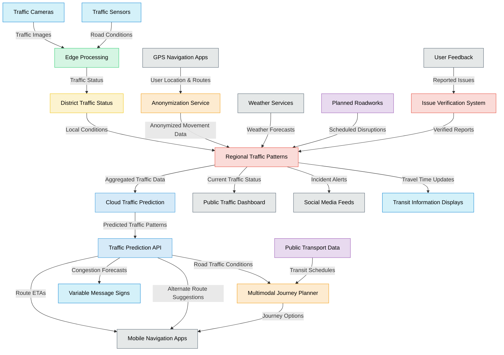
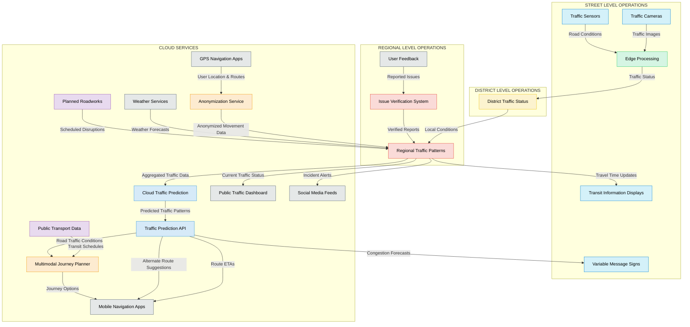

## System Health Monitoring

```mermaid
flowchart TD
    %% Annotations
    subgraph Deployment
        direction TB
        Y[GCP Cloud Monitoring: System telemetry]:::gcpServices
        Z[AWS Systems Manager: Automated remediation]:::awsServices
        AA[Azure Monitor: Resource tracking]:::azureServices
        AB[Grafana dashboards: Monitoring interfaces]:::userFacing
        AC[Prometheus: Fog node monitoring]:::fog
    end

    %% Class definitions for cloud services
    classDef physical fill:#D4F1F9,stroke:#0E86D4,color:black
    classDef edge fill:#D5F5E3,stroke:#2ECC71,color:black
    classDef fog fill:#FCF3CF,stroke:#F1C40F,color:black
    classDef private fill:#FADBD8,stroke:#E74C3C,color:black
    classDef awsServices fill:#FDEBD0,stroke:#F39C12,color:black
    classDef azureServices fill:#D6EAF8,stroke:#3498DB,color:black
    classDef gcpServices fill:#E8DAEF,stroke:#9B59B6,color:black
    classDef userFacing fill:#E5E8E8,stroke:#566573,color:black
    
    %% Apply classes to nodes
    class A,C,D,M physical
    class B edge
    class E,F,G fog
    class H,I,J,K,U,X private
    class N,S,V gcpServices
    class L,W awsServices
    class O,P,T azureServices
    class Q,R userFacing
```

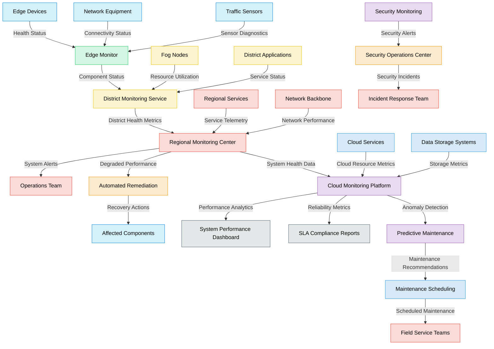

# Justification
- **Best-of-breed service selection**: Each cloud provider has specific strengths that match different system needs:
    - AWS for real-time processing, machine learning, and automated remediation
    - Azure for data storage, time-series analysis, and traffic prediction
    - GCP for big data analytics, environmental monitoring, and system telemetry
- **Workload-appropriate placement**:
    - Time-critical functions (emergency response, traffic signal control) use edge and fog computing
    - Data-intensive analytics leverage cloud scalability
    - Sensitive operations remain in private city infrastructure
- **Redundancy and failover**:
    - Critical services have fallback options across different providers
    - Edge and fog layers can operate independently if cloud connectivity is lost

### Emergency Response System

- **AWS Lambda** for real-time route optimization (millisecond response requirements)
- **Azure Cosmos DB** for emergency data storage (global distribution capabilities)
- **NVIDIA Jetson** devices for edge AI processing (vehicle detection, incident recognition)

### Traffic Signal Optimization

- **GCP AI Platform** for traffic prediction models (advanced ML capabilities)
- **Azure Time Series Insights** for performance data analysis (specialized for time-series data)
- **Kubernetes clusters** for district-level processing (containerized microservices)

### Environmental Monitoring

- **GCP BigQuery** for the environmental data lake (powerful analytics for large datasets)
- **AWS SageMaker** for predictive environmental models (robust ML pipeline)
- **Azure Data Explorer** for historical traffic pattern analysis (query performance)

### Public Information Services

- **Azure ML** for traffic prediction (integration with Azure maps)
- **AWS API Gateway** for traffic information APIs (developer-friendly)
- **GCP Pub/Sub** for public transport data feed (real-time messaging)
- **Progressive Web Apps** for consistent user experience across devices

### System Health Monitoring

- **GCP Cloud Monitoring** for system-wide telemetry (comprehensive monitoring)
- **AWS Systems Manager** for automated remediation (powerful automation tools)
- **Azure Monitor** for resource tracking (detailed resource metrics)
- **Grafana dashboards** for unified monitoring interfaces (cross-platform visualization)

## Integration Approach

The multi-cloud design requires careful integration:

1. **API-first approach**: All services expose standardized APIs regardless of underlying cloud provider
2. **Service mesh architecture**: Istio/Linkerd for service discovery, load balancing, and circuit breaking
3. **Common data formats**: Standardized message formats (JSON, Protocol Buffers) across all components
4. **Unified identity management**: Federated identity across cloud providers and on-premises systems
5. **Cross-cloud monitoring**: Centralized observability platform aggregating telemetry from all environments

# Misc Full System Graphs

```mermaid
flowchart TD
    %% Define styles for different components
    classDef physical fill:#D4F1F9,stroke:#0E86D4,color:black
    classDef edge fill:#D5F5E3,stroke:#2ECC71,color:black
    classDef fog fill:#FCF3CF,stroke:#F1C40F,color:black
    classDef private fill:#FADBD8,stroke:#E74C3C,color:black
    classDef awsServices fill:#FDEBD0,stroke:#F39C12,color:black
    classDef azureServices fill:#D6EAF8,stroke:#3498DB,color:black
    classDef gcpServices fill:#E8DAEF,stroke:#9B59B6,color:black
    classDef userFacing fill:#E5E8E8,stroke:#566573,color:black
    
    %% TRAFFIC SIGNAL CONTROL SYSTEM
    subgraph TrafficSystem["TRAFFIC SIGNAL CONTROL SYSTEM"]
        TS1[Traffic Cameras]:::physical
        TS2[Road Sensors]:::physical
        TS3[Pedestrian Sensors]:::physical
        TS4[Edge Processing Units]:::edge
        TS5[District Traffic Nodes]:::fog
        TS6[Regional Traffic Coordination]:::private
        TS7[Traffic Signal Controllers]:::physical
        TS8[Variable Message Signs]:::physical
        TS9[AI Traffic Prediction]:::gcpServices
        TS10[Traffic Performance Database]:::azureServices
        TS11[Traffic Management Dashboard]:::userFacing

        TS1 & TS2 & TS3 --> TS4
        TS4 --> TS5
        TS5 --> TS6
        TS6 --> TS7 & TS8
        TS5 --> TS9
        TS9 --> TS6
        TS5 & TS6 --> TS10
        TS6 --> TS11
    end

    %% EMERGENCY RESPONSE SYSTEM
    subgraph EmergencySystem["EMERGENCY RESPONSE SYSTEM"]
        ES1[Incident Detection Cameras]:::physical
        ES2[Emergency Vehicle GPS]:::physical
        ES3[Edge Incident Detection]:::edge
        ES4[District Emergency Coordination]:::fog
        ES5[Regional Response Center]:::private
        ES6[Route Optimization Service]:::awsServices
        ES7[Emergency Incident Database]:::azureServices
        ES8[Emergency Dispatch Dashboard]:::userFacing
        ES9[Emergency Vehicle Terminals]:::physical

        ES1 --> ES3
        ES2 --> ES4
        ES3 --> ES4
        ES4 --> ES5
        ES5 <--> ES6
        ES5 --> ES7
        ES5 --> ES8
        ES6 --> ES9
    end

    %% ENVIRONMENTAL MONITORING SYSTEM
    subgraph EnvironmentalSystem["ENVIRONMENTAL MONITORING SYSTEM"]
        EV1[Air Quality Sensors]:::physical
        EV2[Weather Stations]:::physical
        EV3[Vehicle Classification Cameras]:::physical
        EV4[Edge Environmental Monitors]:::edge
        EV5[District Environmental Aggregation]:::fog
        EV6[Environmental Data Lake]:::gcpServices
        EV7[Carbon Footprint Analytics]:::awsServices
        EV8[Historical Traffic Patterns]:::azureServices
        EV9[Environmental Impact Dashboard]:::userFacing
        EV10[Emissions Prediction Models]:::gcpServices

        EV1 & EV2 --> EV4
        EV3 --> EV4
        EV4 --> EV5
        EV5 --> EV6
        EV6 --> EV7
        EV8 --> EV7
        EV7 --> EV9
        EV6 --> EV10
        EV10 --> EV9
    end

    %% PUBLIC INFORMATION SYSTEM
    subgraph PublicSystem["PUBLIC INFORMATION SYSTEM"]
        PI1[Traffic Status Aggregator]:::fog
        PI2[User Location/Routes Data]:::physical
        PI3[Anonymization Service]:::awsServices
        PI4[Traffic Prediction API]:::azureServices
        PI5[Public Transport Data Feed]:::gcpServices
        PI6[Multimodal Journey Planner]:::azureServices
        PI7[Public API Gateway]:::awsServices
        PI8[Mobile Navigation Apps]:::userFacing
        PI9[Transit Information Displays]:::userFacing
        PI10[Social Media Integration]:::userFacing

        PI2 --> PI3
        PI3 --> PI1
        PI1 --> PI4
        PI5 --> PI6
        PI4 --> PI6
        PI4 & PI6 --> PI7
        PI7 --> PI8 & PI9 & PI10
    end

    %% SYSTEM HEALTH MONITORING
    subgraph HealthSystem["SYSTEM HEALTH MONITORING"]
        SH1[Edge Device Monitors]:::edge
        SH2[Network Equipment Monitors]:::physical
        SH3[Fog Node Health Tracker]:::fog
        SH4[District Monitoring Service]:::fog
        SH5[Regional Monitoring Center]:::private
        SH6[Cloud Telemetry Platform]:::gcpServices
        SH7[Automated Remediation System]:::awsServices
        SH8[Resource Metrics Service]:::azureServices
        SH9[System Performance Dashboard]:::userFacing
        SH10[Maintenance Scheduling]:::private
        SH11[Security Operations Center]:::private

        SH1 & SH2 --> SH4
        SH3 --> SH4
        SH4 --> SH5
        SH5 --> SH6
        SH6 --> SH7
        SH6 --> SH8
        SH6 & SH7 & SH8 --> SH9
        SH6 --> SH10
        SH5 --> SH11
    end

    %% CROSS-SYSTEM CONNECTIONS
    %% Traffic to Emergency
    TS4 --> ES3
    TS6 <--> ES5
    TS7 <-- "Signal Priority" --> ES5

    %% Traffic to Environmental
    TS2 --> EV4
    TS5 --> EV5
    TS10 --> EV8

    %% Traffic to Public
    TS6 --> PI1
    TS8 <-- "Display Instructions" --> PI7

    %% Emergency to Public
    ES5 --> PI1
    ES5 --> PI10

    %% Environmental to Traffic
    EV10 --> TS9

    %% Health Monitor connections
    SH5 --> TrafficSystem & EmergencySystem & EnvironmentalSystem & PublicSystem
    SH7 ---> TS4 & TS5 & TS9 & ES3 & ES6 & EV4 & PI4 & PI7
```

```mermaid
flowchart TD
    %% Define styles for different layers
    classDef edgeLayer fill:#D5F5E3,stroke:#2ECC71,color:black
    classDef fogLayer fill:#FCF3CF,stroke:#F1C40F,color:black
    classDef cloudLayer fill:#D6EAF8,stroke:#3498DB,color:black
    classDef applicationLayer fill:#FADBD8,stroke:#E74C3C,color:black
    classDef userLayer fill:#E5E8E8,stroke:#566573,color:black

    %% EDGE LAYER
    subgraph EdgeLayer["EDGE LAYER"]
        %% Traffic Input Sources
        E1[Traffic Cameras]
        E2[Road Sensors]
        E3[Weather Stations]
        E4[Air Quality Sensors]
        E5[GPS Data]
        E6[Emergency Vehicle GPS]
        E7[Pedestrian Sensors]
        E8[Vehicle Classification Cameras]

        %% Edge Processing
        EP1[Edge Analytics Units]
        EP2[Incident Detection]
        EP3[Vehicle Counting]
        EP4[Environmental Monitoring]

        %% Traffic Control Devices
        TC1[Traffic Signal Controllers]
        TC2[Variable Message Signs]
        
        %% Edge connections
        E1 & E2 & E7 --> EP1
        E1 & E2 & E6 --> EP2
        E1 & E2 --> EP3
        E3 & E4 --> EP4
        E8 --> EP1
    end

    %% FOG LAYER
    subgraph FogLayer["FOG LAYER"]
        %% District Level
        F1[District Processing Node]
        F2[Local Traffic Optimization]
        F3[District Data Cache]
        F4[Edge Device Management]
        
        %% Regional Level
        F5[Regional Control Center]
        F6[Cross-District Coordination]
        F7[Emergency Response Routing]
        F8[Regional Data Aggregation]
        
        %% Fog connections
        F1 --> F2
        F1 --> F3
        F1 --> F4
        F3 --> F5
        F5 --> F6
        F5 --> F7
        F5 --> F8
    end

    %% CLOUD LAYER
    subgraph CloudLayer["CLOUD LAYER"]
        %% Data Processing
        C1[Stream Processing]:::awsServices
        C2[Machine Learning Pipeline]:::gcpServices
        C3[Historical Data Analysis]:::azureServices
        
        %% Storage
        C4[Time-Series Database]:::azureServices
        C5[Data Warehouse]:::gcpServices
        C6[Event Store]:::awsServices
        
        %% Management
        C7[Global Traffic Optimization]:::gcpServices
        C8[Predictive Analytics]:::awsServices
        C9[Environmental Impact Models]:::gcpServices
        C10[System Health Monitoring]:::awsServices
        
        %% Cloud connections
        C1 --> C2
        C1 --> C4
        C4 --> C3
        C3 --> C5
        C1 --> C6
        C4 & C5 --> C7
        C4 & C5 --> C8
        C4 & C5 --> C9
    end

    %% APPLICATION LAYER
    subgraph AppLayer["APPLICATION LAYER"]
        %% Traffic Management
        A1[Traffic Management Dashboard]
        A2[Signal Optimization Service]
        A3[Congestion Management]
        
        %% Emergency Services
        A4[Emergency Services Integration]
        A5[Incident Response Coordination]
        A6[Emergency Vehicle Routing]
        
        %% Environmental
        A7[Environmental Impact Dashboard]
        A8[Carbon Footprint Analysis]
        A9[Air Quality Monitoring]
        
        %% Public Information
        A10[Public API Gateway]
        A11[Multimodal Journey Planner]
        A12[Public Notification System]
        
        %% System Management
        A13[System Performance Dashboard]
        A14[Maintenance Scheduling]
        A15[Security Operations Center]
    end

    %% USER INTERFACES
    subgraph UserLayer["USER INTERFACES"]
        %% City Operators
        U1[Traffic Control Center]
        U2[Emergency Dispatch]
        U3[Environmental Monitoring]
        U4[System Administration]
        
        %% Public
        U5[Mobile Navigation Apps]
        U6[Public Transport Apps]
        U7[City Information Portals]
        U8[Variable Road Signs]
    end

    %% CROSS-LAYER CONNECTIONS
    
    %% Edge to Fog
    EP1 & EP2 & EP3 & EP4 --> F1
    TC1 & TC2 <--> F1
    E5 --> F5
    E6 --> F7
    EP2 --> F7
    
    %% Fog to Cloud
    F3 --> C1
    F8 --> C1
    F2 <--> C7
    F7 <--> C8
    F5 --> C10
    
    %% Cloud to Application
    C7 --> A2
    C7 --> A3
    C8 --> A5
    C8 --> A6
    C9 --> A7
    C9 --> A8
    C9 --> A9
    C4 & C5 --> A10
    C7 & C8 --> A11
    C10 --> A13
    C10 --> A14
    C10 --> A15
    
    %% Application to User
    A1 & A2 & A3 --> U1
    A4 & A5 & A6 --> U2
    A7 & A8 & A9 --> U3
    A13 & A14 & A15 --> U4
    A10 & A11 --> U5
    A10 & A11 --> U6
    A10 & A12 --> U7
    A3 & A12 --> U8

    %% Apply styles
    class EdgeLayer edgeLayer
    class E1,E2,E3,E4,E5,E6,E7,E8,EP1,EP2,EP3,EP4,TC1,TC2 edgeLayer
    
    class FogLayer fogLayer
    class F1,F2,F3,F4,F5,F6,F7,F8 fogLayer
    
    class CloudLayer cloudLayer
    class C1,C2,C3,C4,C5,C6,C7,C8,C9,C10 cloudLayer
    
    class AppLayer applicationLayer
    class A1,A2,A3,A4,A5,A6,A7,A8,A9,A10,A11,A12,A13,A14,A15 applicationLayer
    
    class UserLayer userLayer
    class U1,U2,U3,U4,U5,U6,U7,U8 userLayer

    %% Additional styles for cloud services
    classDef awsServices fill:#FDEBD0,stroke:#F39C12,color:black
    classDef azureServices fill:#D6EAF8,stroke:#3498DB,color:black
    classDef gcpServices fill:#E8DAEF,stroke:#9B59B6,color:black
```

```mermaid
flowchart TD
    %% Class definitions for cloud services
    classDef physical fill:#D4F1F9,stroke:#0E86D4,color:black
    classDef edge fill:#D5F5E3,stroke:#2ECC71,color:black
    classDef fog fill:#FCF3CF,stroke:#F1C40F,color:black
    classDef private fill:#FADBD8,stroke:#E74C3C,color:black
    classDef awsServices fill:#FDEBD0,stroke:#F39C12,color:black
    classDef azureServices fill:#D6EAF8,stroke:#3498DB,color:black
    classDef gcpServices fill:#E8DAEF,stroke:#9B59B6,color:black
    classDef userFacing fill:#E5E8E8,stroke:#566573,color:black
    
    %% CORE SHARED COMPONENTS
    SC1[Traffic Cameras]:::physical
    SC2[Road Sensors]:::physical
    SC3[Weather Stations]:::physical
    SC4[Edge Processing]:::edge
    SC5[District Processing]:::fog
    SC6[Regional Control]:::private
    SC7[Central Data Storage]:::azureServices
    SC8[Analytics Platform]:::gcpServices

    %% TRAFFIC SIGNAL SYSTEM
    subgraph TrafficSystem["TRAFFIC SIGNAL SYSTEM"]
        TS1[Traffic Signal Controllers]:::physical
        TS2[Variable Message Signs]:::physical
        TS3[Pedestrian Sensors]:::physical
        TS4[District Traffic Node]:::fog
        TS5[Traffic Optimization]:::gcpServices
        TS6[Time-Series Database]:::azureServices
        TS7[Traffic Dashboard]:::userFacing
    end
    
    %% EMERGENCY RESPONSE SYSTEM
    subgraph EmergencySystem["EMERGENCY RESPONSE SYSTEM"]
        ES1[Emergency Vehicle GPS]:::physical
        ES2[911 Call Center]:::physical
        ES3[Cloud Traffic Analytics]:::awsServices
        ES4[Route Optimization]:::awsServices
        ES5[Emergency Vehicles]:::physical
        ES6[Emergency Dashboard]:::userFacing
    end
    
    %% ENVIRONMENTAL MONITORING SYSTEM
    subgraph EnvironmentalSystem["ENVIRONMENTAL MONITORING SYSTEM"]
        EV1[Air Quality Sensors]:::physical
        EV2[Vehicle Classification]:::edge
        EV3[Cloud Data Lake]:::gcpServices
        EV4[Carbon Footprint Analysis]:::gcpServices
        EV5[Predictive Models]:::awsServices
        EV6[Environmental Dashboard]:::userFacing
        EV7[Impact Simulator]:::awsServices
    end
    
    %% PUBLIC INFORMATION SYSTEM
    subgraph PublicSystem["PUBLIC INFORMATION SYSTEM"]
        PI1[GPS Navigation Apps]:::userFacing
        PI2[Anonymization Service]:::awsServices
        PI3[Traffic Prediction]:::azureServices
        PI4[Multimodal Planner]:::awsServices
        PI5[Public Transport Data]:::gcpServices
        PI6[Public Notification]:::userFacing
        PI7[Transit Displays]:::physical
    end
    
    %% SYSTEM HEALTH MONITORING
    subgraph HealthSystem["SYSTEM HEALTH MONITORING"]
        SH1[Edge Monitors]:::edge
        SH2[Network Monitoring]:::physical
        SH3[Cloud Monitoring Platform]:::gcpServices
        SH4[Automated Remediation]:::awsServices
        SH5[Performance Dashboard]:::userFacing
        SH6[Security Operations]:::awsServices
    end
    
    %% CONNECTIONS WITHIN TRAFFIC SYSTEM
    SC1 --> SC4
    SC2 --> SC4
    SC3 --> SC4
    SC4 --> SC5
    SC5 --> SC6
    SC6 --> SC7
    SC7 --> SC8
    
    SC4 --> TS4
    TS3 --> SC4
    TS4 --> TS5
    TS5 --> TS1
    TS4 --> TS6
    TS6 --> TS5
    SC6 --> TS2
    SC6 --> TS7
    
    %% CONNECTIONS WITHIN EMERGENCY SYSTEM
    SC1 --> SC4 --> ES3
    ES1 --> SC5
    ES2 --> SC6
    SC6 --> ES3
    ES3 --> ES4
    ES4 --> ES5
    SC6 --> ES6
    SC7 --> ES6
    
    %% CONNECTIONS WITHIN ENVIRONMENTAL SYSTEM
    EV1 --> SC4
    SC2 --> EV2
    EV2 --> SC5
    SC5 --> EV3
    EV3 --> EV4
    EV4 --> EV6
    SC7 --> EV4
    EV3 --> EV5
    EV5 --> EV7
    EV7 --> SC6
    
    %% CONNECTIONS WITHIN PUBLIC SYSTEM
    PI1 --> PI2
    PI2 --> SC6
    SC6 --> PI3
    PI5 --> PI4
    PI3 --> PI4
    PI4 --> PI1
    PI3 --> PI6
    PI3 --> PI7
    SC6 --> PI6
    
    %% CONNECTIONS WITHIN HEALTH SYSTEM
    SH1 --> SC5
    SH2 --> SC5
    SC5 --> SH3
    SH3 --> SH4
    SH3 --> SH5
    SH3 --> SH6
    SH4 --> SC4 & SC5 & SC6
    
    %% CROSS-SYSTEM CONNECTIONS
    SC6 --> TS1 & TS2
    ES3 --> TS1
    TS4 --> EV3
    ES6 --> PI6
    TS7 --> PI3
    EV6 --> PI6
    TS5 --> EV7
```
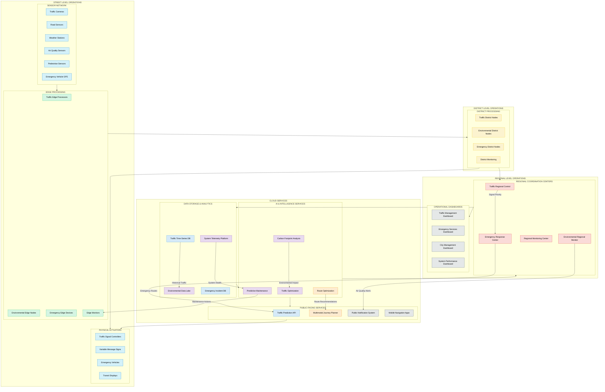
