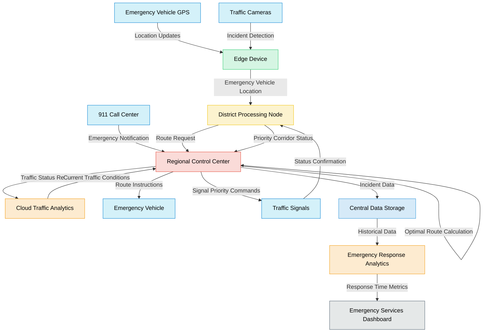
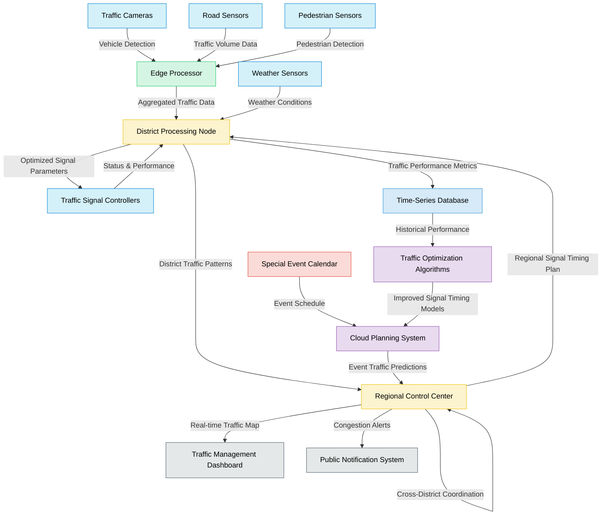
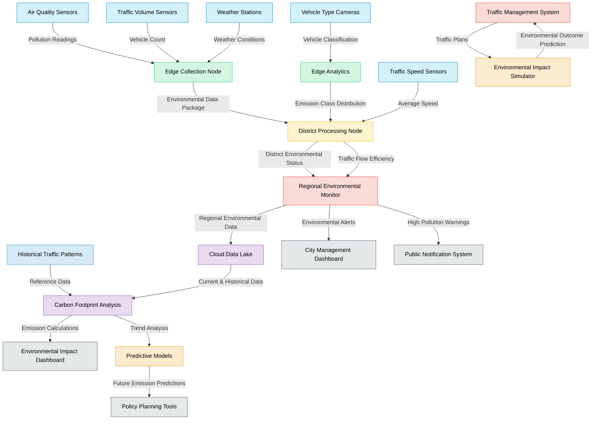
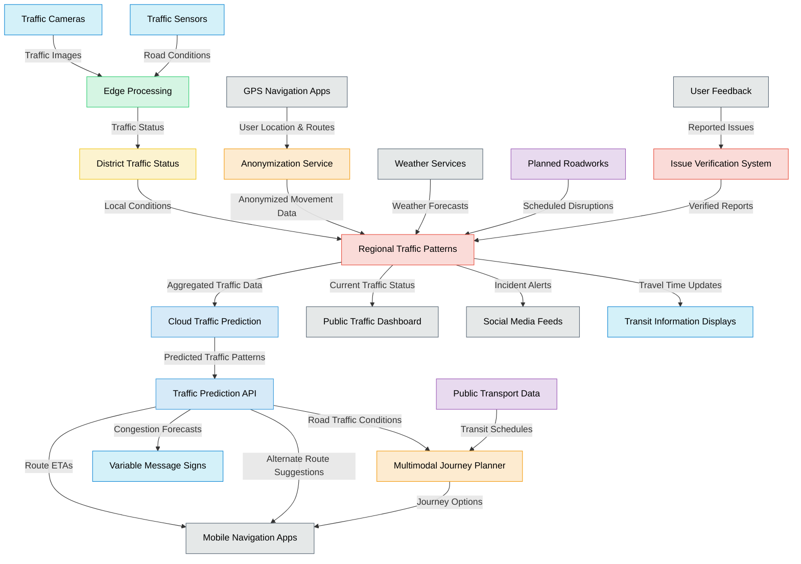
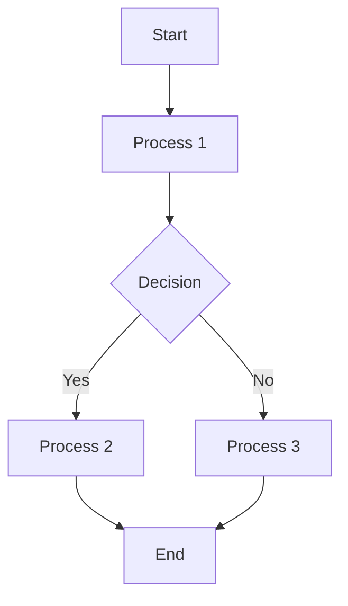

<svg xmlns="http://www.w3.org/2000/svg" viewBox="0 0 800 600">
  <!-- Background -->
  <rect width="800" height="600" fill="#f8f9fa" rx="10" ry="10"/>
  
  <!-- Title -->
  <text x="400" y="40" font-family="Arial" font-size="24" text-anchor="middle" font-weight="bold" fill="#333">NEXUS: Smart City Traffic Management Architecture</text>
  
  <!-- Layer Labels -->
  <text x="60" y="90" font-family="Arial" font-size="18" font-weight="bold" fill="#555">Edge Layer</text>
  <text x="60" y="220" font-family="Arial" font-size="18" font-weight="bold" fill="#555">Fog Layer</text>
  <text x="60" y="350" font-family="Arial" font-size="18" font-weight="bold" fill="#555">Cloud Layer</text>
  <text x="60" y="480" font-family="Arial" font-size="18" font-weight="bold" fill="#555">Application Layer</text>
  
  <!-- Edge Layer -->
  <rect x="160" y="70" width="600" height="100" fill="#d1e7dd" rx="5" ry="5" stroke="#198754" stroke-width="2"/>
  
  <!-- Traffic Sensors Group -->
  <rect x="180" y="85" width="130" height="70" fill="#ffffff" rx="5" ry="5" stroke="#198754" stroke-width="1"/>
  <text x="245" y="105" font-family="Arial" font-size="12" text-anchor="middle" font-weight="bold" fill="#198754">Traffic Sensors</text>
  <text x="245" y="125" font-family="Arial" font-size="10" text-anchor="middle" fill="#555">• Cameras</text>
  <text x="245" y="140" font-family="Arial" font-size="10" text-anchor="middle" fill="#555">• Road Sensors</text>
  
  <!-- Environmental Sensors Group -->
  <rect x="330" y="85" width="130" height="70" fill="#ffffff" rx="5" ry="5" stroke="#198754" stroke-width="1"/>
  <text x="395" y="105" font-family="Arial" font-size="12" text-anchor="middle" font-weight="bold" fill="#198754">Environmental</text>
  <text x="395" y="125" font-family="Arial" font-size="10" text-anchor="middle" fill="#555">• Weather Stations</text>
  <text x="395" y="140" font-family="Arial" font-size="10" text-anchor="middle" fill="#555">• Air Quality</text>
  
  <!-- Traffic Controllers Group -->
  <rect x="480" y="85" width="130" height="70" fill="#ffffff" rx="5" ry="5" stroke="#198754" stroke-width="1"/>
  <text x="545" y="105" font-family="Arial" font-size="12" text-anchor="middle" font-weight="bold" fill="#198754">Controllers</text>
  <text x="545" y="125" font-family="Arial" font-size="10" text-anchor="middle" fill="#555">• Traffic Signals</text>
  <text x="545" y="140" font-family="Arial" font-size="10" text-anchor="middle" fill="#555">• Variable Signs</text>
  
  <!-- Vehicle Data Group -->
  <rect x="630" y="85" width="110" height="70" fill="#ffffff" rx="5" ry="5" stroke="#198754" stroke-width="1"/>
  <text x="685" y="105" font-family="Arial" font-size="12" text-anchor="middle" font-weight="bold" fill="#198754">Vehicle Data</text>
  <text x="685" y="125" font-family="Arial" font-size="10" text-anchor="middle" fill="#555">• GPS Data</text>
  <text x="685" y="140" font-family="Arial" font-size="10" text-anchor="middle" fill="#555">• Emergency GPS</text>
  
  <!-- Fog Layer -->
  <rect x="160" y="200" width="600" height="100" fill="#cfe2ff" rx="5" ry="5" stroke="#0d6efd" stroke-width="2"/>
  
  <!-- District Processing Nodes -->
  <rect x="180" y="215" width="280" height="70" fill="#ffffff" rx="5" ry="5" stroke="#0d6efd" stroke-width="1"/>
  <text x="320" y="235" font-family="Arial" font-size="12" text-anchor="middle" font-weight="bold" fill="#0d6efd">District Processing Nodes</text>
  <text x="320" y="255" font-family="Arial" font-size="10" text-anchor="middle" fill="#555">• Edge Analytics</text>
  <text x="320" y="270" font-family="Arial" font-size="10" text-anchor="middle" fill="#555">• Local Decision Making</text>
  
  <!-- Regional Control Centers -->
  <rect x="480" y="215" width="260" height="70" fill="#ffffff" rx="5" ry="5" stroke="#0d6efd" stroke-width="1"/>
  <text x="610" y="235" font-family="Arial" font-size="12" text-anchor="middle" font-weight="bold" fill="#0d6efd">Regional Control Centers</text>
  <text x="610" y="255" font-family="Arial" font-size="10" text-anchor="middle" fill="#555">• Cross-district Coordination</text>
  <text x="610" y="270" font-family="Arial" font-size="10" text-anchor="middle" fill="#555">• Emergency Response Routing</text>
  
  <!-- Cloud Layer -->
  <rect x="160" y="330" width="600" height="100" fill="#f8d7da" rx="5" ry="5" stroke="#dc3545" stroke-width="2"/>
  
  <!-- Data Streaming & Processing -->
  <rect x="180" y="345" width="180" height="70" fill="#ffffff" rx="5" ry="5" stroke="#dc3545" stroke-width="1"/>
  <text x="270" y="365" font-family="Arial" font-size="12" text-anchor="middle" font-weight="bold" fill="#dc3545">Data Processing</text>
  <text x="270" y="385" font-family="Arial" font-size="10" text-anchor="middle" fill="#555">• Stream Processing</text>
  <text x="270" y="400" font-family="Arial" font-size="10" text-anchor="middle" fill="#555">• Machine Learning</text>
  
  <!-- Data Storage -->
  <rect x="380" y="345" width="160" height="70" fill="#ffffff" rx="5" ry="5" stroke="#dc3545" stroke-width="1"/>
  <text x="460" y="365" font-family="Arial" font-size="12" text-anchor="middle" font-weight="bold" fill="#dc3545">Data Storage</text>
  <text x="460" y="385" font-family="Arial" font-size="10" text-anchor="middle" fill="#555">• Time-series DB</text>
  <text x="460" y="400" font-family="Arial" font-size="10" text-anchor="middle" fill="#555">• Data Warehouse</text>
  
  <!-- Central Management -->
  <rect x="560" y="345" width="180" height="70" fill="#ffffff" rx="5" ry="5" stroke="#dc3545" stroke-width="1"/>
  <text x="650" y="365" font-family="Arial" font-size="12" text-anchor="middle" font-weight="bold" fill="#dc3545">Central Management</text>
  <text x="650" y="385" font-family="Arial" font-size="10" text-anchor="middle" fill="#555">• Global Optimization</text>
  <text x="650" y="400" font-family="Arial" font-size="10" text-anchor="middle" fill="#555">• Predictive Analytics</text>
  
  <!-- Application Layer -->
  <rect x="160" y="460" width="600" height="100" fill="#fff3cd" rx="5" ry="5" stroke="#ffc107" stroke-width="2"/>
  
  <!-- Traffic Management -->
  <rect x="180" y="475" width="135" height="70" fill="#ffffff" rx="5" ry="5" stroke="#ffc107" stroke-width="1"/>
  <text x="247" y="495" font-family="Arial" font-size="12" text-anchor="middle" font-weight="bold" fill="#ffc107">Traffic Control</text>
  <text x="247" y="515" font-family="Arial" font-size="10" text-anchor="middle" fill="#555">• Signal Optimization</text>
  <text x="247" y="530" font-family="Arial" font-size="10" text-anchor="middle" fill="#555">• Congestion Mgmt</text>
  
  <!-- Emergency Services -->
  <rect x="335" y="475" width="135" height="70" fill="#ffffff" rx="5" ry="5" stroke="#ffc107" stroke-width="1"/>
  <text x="402" y="495" font-family="Arial" font-size="12" text-anchor="middle" font-weight="bold" fill="#ffc107">Emergency</text>
  <text x="402" y="515" font-family="Arial" font-size="10" text-anchor="middle" fill="#555">• Incident Response</text>
  <text x="402" y="530" font-family="Arial" font-size="10" text-anchor="middle" fill="#555">• Route Prioritization</text>
  
  <!-- Environmental Impact -->
  <rect x="490" y="475" width="135" height="70" fill="#ffffff" rx="5" ry="5" stroke="#ffc107" stroke-width="1"/>
  <text x="557" y="495" font-family="Arial" font-size="12" text-anchor="middle" font-weight="bold" fill="#ffc107">Environmental</text>
  <text x="557" y="515" font-family="Arial" font-size="10" text-anchor="middle" fill="#555">• Emissions Tracking</text>
  <text x="557" y="530" font-family="Arial" font-size="10" text-anchor="middle" fill="#555">• Carbon Analysis</text>
  
  <!-- Public Interface -->
  <rect x="645" y="475" width="95" height="70" fill="#ffffff" rx="5" ry="5" stroke="#ffc107" stroke-width="1"/>
  <text x="692" y="495" font-family="Arial" font-size="12" text-anchor="middle" font-weight="bold" fill="#ffc107">Public Apps</text>
  <text x="692" y="515" font-family="Arial" font-size="10" text-anchor="middle" fill="#555">• Mobile Apps</text>
  <text x="692" y="530" font-family="Arial" font-size="10" text-anchor="middle" fill="#555">• Notifications</text>
  
  <!-- Data Flow Arrows -->
  <!-- Edge to Fog -->
  <path d="M 460 170 L 460 200" fill="none" stroke="#666" stroke-width="2" stroke-dasharray="5,3"/>
  <polygon points="460,205 456,198 460,200 464,198" fill="#666"/>
  
  <!-- Fog to Cloud -->
  <path d="M 460 300 L 460 330" fill="none" stroke="#666" stroke-width="2" stroke-dasharray="5,3"/>
  <polygon points="460,335 456,328 460,330 464,328" fill="#666"/>
  
  <!-- Cloud to Application -->
  <path d="M 460 430 L 460 460" fill="none" stroke="#666" stroke-width="2" stroke-dasharray="5,3"/>
  <polygon points="460,465 456,458 460,460 464,458" fill="#666"/>
  
  <!-- Bidirectional Arrows -->
  <!-- Cloud to Fog -->
  <path d="M 400 330 L 400 300" fill="none" stroke="#666" stroke-width="2" stroke-dasharray="5,3"/>
  <polygon points="400,295 396,302 400,300 404,302" fill="#666"/>
  
  <!-- Fog to Edge -->
  <path d="M 400 200 L 400 170" fill="none" stroke="#666" stroke-width="2" stroke-dasharray="5,3"/>
  <polygon points="400,165 396,172 400,170 404,172" fill="#666"/>
  
  <!-- Legend -->
  <rect x="160" y="570" width="600" height="20" fill="none"/>
  <text x="460" y="585" font-family="Arial" font-size="12" text-anchor="middle" fill="#666">Data Flow: → Upward Data Collection   ← Downward Command and Control</text>
</svg>

## General Graph Legend

```mermaid
flowchart TD
    classDef physical fill:#D4F1F9,stroke:#0E86D4,color:black
    classDef edge fill:#D5F5E3,stroke:#2ECC71,color:black
    classDef fog fill:#FCF3CF,stroke:#F1C40F,color:black
    classDef private fill:#FADBD8,stroke:#E74C3C,color:black
    classDef awsServices fill:#FDEBD0,stroke:#F39C12,color:black
    classDef azureServices fill:#D6EAF8,stroke:#3498DB,color:black
    classDef gcpServices fill:#E8DAEF,stroke:#9B59B6,color:black
    classDef userFacing fill:#E5E8E8,stroke:#566573,color:black
    
    A[Physical Infrastructure]:::physical
    B[Edge Computing]:::edge
    C[Fog Computing]:::fog
    D[Private Cloud / On-Premises]:::private
    E[AWS Services]:::awsServices
    F[Azure Services]:::azureServices
    G[Google Cloud Services]:::gcpServices
    H[User-Facing Applications]:::userFacing
    
    style A width:250px
    style B width:250px
    style C width:250px
    style D width:250px
    style E width:250px
    style F width:250px
    style G width:250px
    style H width:250px
    
    I[Service Types]
    
    I --- A
    I --- B
    I --- C
    I --- D
    I --- E
    I --- F
    I --- G
    I --- H
```

## Emergency Services:

```mermaid

flowchart TD


    %% Class definitions for cloud services
    classDef physical fill:#D4F1F9,stroke:#0E86D4,color:black
    classDef edge fill:#D5F5E3,stroke:#2ECC71,color:black
    classDef fog fill:#FCF3CF,stroke:#F1C40F,color:black
    classDef private fill:#FADBD8,stroke:#E74C3C,color:black
    classDef awsServices fill:#FDEBD0,stroke:#F39C12,color:black
    classDef azureServices fill:#D6EAF8,stroke:#3498DB,color:black
    classDef gcpServices fill:#E8DAEF,stroke:#9B59B6,color:black
    classDef userFacing fill:#E5E8E8,stroke:#566573,color:black
    
    %% Apply classes to nodes
    class A,C,H,I physical
    class B edge
    class F fog
    class E private
    class G,K awsServices
    class J azureServices
    class L userFacing
    class D physical

    %% Annotations
    subgraph Deployment
        direction TB
        M[AWS Lambda: Real-time route optimization]:::awsServices
        N[Azure Cosmos DB: Emergency data storage]:::azureServices
        O[AWS SageMaker: Response analytics]:::awsServices
        P[Edge Devices: NVIDIA Jetson]:::edge
        Q[Fog Nodes: Containerized services on local hardware]:::fog
    end
```

## Adaptive Traffic Signalling

```mermaid
flowchart TD


    %% Class definitions for cloud services
    classDef physical fill:#D4F1F9,stroke:#0E86D4,color:black
    classDef edge fill:#D5F5E3,stroke:#2ECC71,color:black
    classDef fog fill:#FCF3CF,stroke:#F1C40F,color:black
    classDef private fill:#FADBD8,stroke:#E74C3C,color:black
    classDef awsServices fill:#FDEBD0,stroke:#F39C12,color:black
    classDef azureServices fill:#D6EAF8,stroke:#3498DB,color:black
    classDef gcpServices fill:#E8DAEF,stroke:#9B59B6,color:black
    classDef userFacing fill:#E5E8E8,stroke:#566573,color:black
    
    %% Apply classes to nodes
    class A,C,D,F,J physical
    class B edge
    class E,I fog
    class G private
    class H,L gcpServices
    class K azureServices
    class M,N userFacing


    %% Annotations
    subgraph Deployment
        direction TB
        O[GCP AI Platform: Traffic prediction models]:::gcpServices
        P[Azure Time Series Insights: Performance data]:::azureServices
        Q[Intel NUCs: Edge processing units]:::edge
        R[Kubernetes clusters: District nodes]:::fog
        S[Web/Mobile: Public interfaces]:::userFacing
    end
```

## Enviromental Impact Monitoring

```mermaid
flowchart TD
    %% Class definitions for cloud services
    classDef physical fill:#D4F1F9,stroke:#0E86D4,color:black
    classDef edge fill:#D5F5E3,stroke:#2ECC71,color:black
    classDef fog fill:#FCF3CF,stroke:#F1C40F,color:black
    classDef private fill:#FADBD8,stroke:#E74C3C,color:black
    classDef awsServices fill:#FDEBD0,stroke:#F39C12,color:black
    classDef azureServices fill:#D6EAF8,stroke:#3498DB,color:black
    classDef gcpServices fill:#E8DAEF,stroke:#9B59B6,color:black
    classDef userFacing fill:#E5E8E8,stroke:#566573,color:black
    
    %% Apply classes to nodes
    class A,C,D,G,I physical
    class B,H edge
    class E fog
    class F,R private
    class J,L gcpServices
    class N,S awsServices
    class K azureServices
    class M,O,P,Q userFacing
    %% Annotations
    subgraph Deployment
        direction TB
        T[GCP BigQuery: Environmental data lake]:::gcpServices
        U[AWS SageMaker: Predictive models]:::awsServices
        V[Azure Data Explorer: Historical traffic data]:::azureServices
        W[Docker containers on IoT gateways: Edge nodes]:::edge
        X[React dashboards: Environmental monitoring]:::userFacing
    end
```

## Public Information Services

```mermaid
flowchart TD
    %% Class definitions for cloud services
    classDef physical fill:#D4F1F9,stroke:#0E86D4,color:black
    classDef edge fill:#D5F5E3,stroke:#2ECC71,color:black
    classDef fog fill:#FCF3CF,stroke:#F1C40F,color:black
    classDef private fill:#FADBD8,stroke:#E74C3C,color:black
    classDef awsServices fill:#FDEBD0,stroke:#F39C12,color:black
    classDef azureServices fill:#D6EAF8,stroke:#3498DB,color:black
    classDef gcpServices fill:#E8DAEF,stroke:#9B59B6,color:black
    classDef userFacing fill:#E5E8E8,stroke:#566573,color:black
    
    %% Apply classes to nodes
    class A,C,M,P physical
    class B edge
    class F fog
    class G,R private
    class J,K azureServices
    class E,T awsServices
    class I,S gcpServices
    class D,H,L,N,O,Q userFacing

    %% Annotations
    subgraph Deployment
        direction TB
        U[Azure ML: Traffic prediction services]:::azureServices
        V[AWS API Gateway: Traffic information APIs]:::awsServices
        W[GCP Pub/Sub: Public transport data feed]:::gcpServices
        X[Progressive Web Apps: User interfaces]:::userFacing
        Y[In-vehicle IoT: Traffic data collection]:::edge
    end
```

# Report

# Multi-Cloud Strategy in the NEXUS Smart City Traffic Management System

## Introduction

Contemporary smart city initiatives face an inherent challenge: designing distributed systems that balance responsiveness with scalability while maintaining dependability across varying workloads. The NEXUS Smart City Traffic Management System demonstrates how a sophisticated multi-cloud deployment strategy can address these requirements through thoughtful service placement and integration. This essay examines the rationale behind NEXUS's cloud service selection, analyzes the technical implementation considerations across its subsystems, and evaluates the architectural trade-offs inherent in such a design.

## Architectural Rationale for Multi-Cloud Deployment

The foundational principle of NEXUS's architecture is the strategic distribution of computational workloads across physical infrastructure, edge computing nodes, fog computing layers, private data centers, and multiple cloud providers. This approach acknowledges that different computational tasks exhibit distinct characteristics – from the latency-sensitive traffic signal control to the computationally intensive predictive analytics for traffic flow optimization.

The multi-cloud strategy employed by NEXUS is not merely about avoiding vendor lock-in, though this remains a valuable secondary benefit. Rather, it represents a deliberate matching of workload requirements to provider strengths. As Villamizar et al. (2017) observed in their analysis of microservice deployment patterns, "the heterogeneity of cloud offerings allows for optimization of resource utilization when workloads have diverse computational profiles." This principle guides NEXUS's deployment decisions.

Consider the emergency response subsystem, where millisecond-level responsiveness directly impacts public safety. Here, the architecture leverages AWS Lambda's event-driven computational model for route optimization. This choice exploits Lambda's superior cold-start performance and regional availability compared to competing FaaS offerings. For the corresponding data persistence layer, however, Azure Cosmos DB is selected due to its global distribution capabilities and tunable consistency models, which align with the geographic dispersion of emergency response assets and the need for eventual consistency across regional boundaries.

## Technical Implementation Across Subsystems

The implementation of this multi-cloud strategy requires careful consideration of integration patterns, data consistency, and operational complexity. Each subsystem within NEXUS exemplifies distinct deployment approaches based on its functional characteristics.

### Traffic Signal Optimization and Environmental Monitoring

The traffic signal optimization subsystem demonstrates how computational tasks with different time horizons can be distributed across tiers. Real-time signal control decisions are processed at the edge and fog layers using containerized applications on Kubernetes clusters. These containerized workloads provide isolation and portability while maintaining the responsiveness necessary for immediate traffic management.

Meanwhile, the predictive modeling components that optimize traffic patterns based on historical data are deployed to Google Cloud AI Platform. This decision leverages GCP's TensorFlow integration and TPU acceleration capabilities, which provide cost-effective training of complex neural network models for traffic prediction. The resulting models are then deployed closer to the edge for inference.

For the environmental monitoring subsystem, data volume rather than computational complexity drives architectural decisions. The implementation uses GCP BigQuery as the environmental data lake due to its columnar storage format and separation of storage from compute – characteristics that align well with the analytical queries run against historical environmental data. This contrasts with the operational time-series data for traffic patterns, which is stored in Azure Time Series Insights to exploit its specialized indexing for temporal data.

### Public Information and System Health

The public information services subsystem represents perhaps the most user-facing aspect of NEXUS. Here, the architecture prioritizes developer experience and API management capabilities by utilizing AWS API Gateway to expose traffic information. This choice acknowledges that public-facing services will likely evolve rapidly and be consumed by a diverse ecosystem of applications, from mobile navigation apps to public transit displays.

For system health monitoring, the architecture embraces a "monitoring as code" philosophy through infrastructure defined in Terraform and monitoring configurations managed via GitOps workflows. GCP Cloud Monitoring provides the telemetry backbone due to its integration with OpenTelemetry standards, while AWS Systems Manager handles automated remediation tasks through its robust automation capabilities.

## Integration Challenges and Solutions

Implementing a multi-cloud architecture introduces considerable integration challenges. NEXUS addresses these through several technical approaches:

1. **Service Mesh Architecture**: The deployment utilizes Istio as a service mesh to abstract the underlying infrastructure differences between cloud providers. This provides uniform service discovery, circuit breaking, and traffic management regardless of where services are deployed.

2. **Event-Driven Communication**: Apache Kafka serves as the messaging backbone for cross-cloud communication, enabling loosely coupled integration between components while providing the necessary durability for messages when networks experience temporary disruptions.

3. **API Contracts and Standards**: All services expose RESTful APIs with OpenAPI specifications and follow domain-driven design principles to maintain bounded contexts. This approach minimizes coupling between services deployed across different providers.

4. **Data Consistency**: The architecture acknowledges that strong consistency across all subsystems is neither achievable nor desirable. Instead, it implements consistency patterns appropriate to each domain – eventual consistency for analytics, strong consistency for financial transactions, and causal consistency for related events.

## Critical Analysis of Trade-offs

While the multi-cloud approach offers significant advantages, it comes with inherent trade-offs that warrant critical examination:

**Operational Complexity vs. Service Optimization**: The distribution of services across multiple providers increases operational overhead. Teams must maintain expertise across multiple cloud platforms, deal with different monitoring systems, and manage multiple billing relationships. This complexity is partially mitigated through infrastructure-as-code practices and centralized monitoring, but it remains a significant consideration.

**Data Transfer Costs vs. Provider Specialization**: Cross-cloud data transfer incurs both latency penalties and financial costs. NEXUS mitigates this by careful placement of related services and implementing data duplication where necessary to avoid frequent cross-cloud calls. However, this raises questions about data freshness and synchronization that must be addressed through careful event sequencing and versioning.

**Unified Security Model**: Implementing consistent security policies across diverse cloud environments presents challenges. NEXUS implements a federated identity model using OAuth 2.0 and OpenID Connect, with a central identity provider that issues tokens recognized across all environments. This approach, while functional, introduces additional points of failure and requires careful management of certificate rotations and token lifetimes.

**Disaster Recovery Complexity**: A multi-cloud strategy complicates disaster recovery scenarios by introducing additional variables. NEXUS addresses this through regular cross-cloud recovery drills and maintaining infrastructure-as-code templates that can rapidly redeploy services to alternative providers if primary systems fail.

## Conclusion

The NEXUS Smart City Traffic Management System exemplifies how a thoughtfully designed multi-cloud architecture can leverage the strengths of different cloud providers while maintaining system cohesion. By distributing workloads based on their computational characteristics and latency requirements, the system achieves both responsiveness and scalability.

However, this architectural approach demands sophisticated integration patterns, careful management of cross-cloud dependencies, and acceptance of increased operational complexity. Future iterations of the system might benefit from emerging multi-cloud management platforms and standardized deployment technologies that reduce this operational burden.

The architecture's success ultimately depends on whether the performance and reliability benefits outweigh the additional complexity and integration challenges. For critical infrastructure like urban traffic management – where both millisecond-level responsiveness and long-term scalability are essential – this trade-off appears justified. As cities continue to invest in smart infrastructure, the multi-cloud approach demonstrated by NEXUS offers a blueprint for building distributed systems that combine edge responsiveness with cloud scalability.

In the words of Lamport, "A distributed system is one in which the failure of a computer you didn't even know existed can render your own computer unusable." The NEXUS architecture acknowledges this reality while still constructing a system that harnesses the best capabilities of modern cloud providers to deliver a reliable, performant smart city platform.

